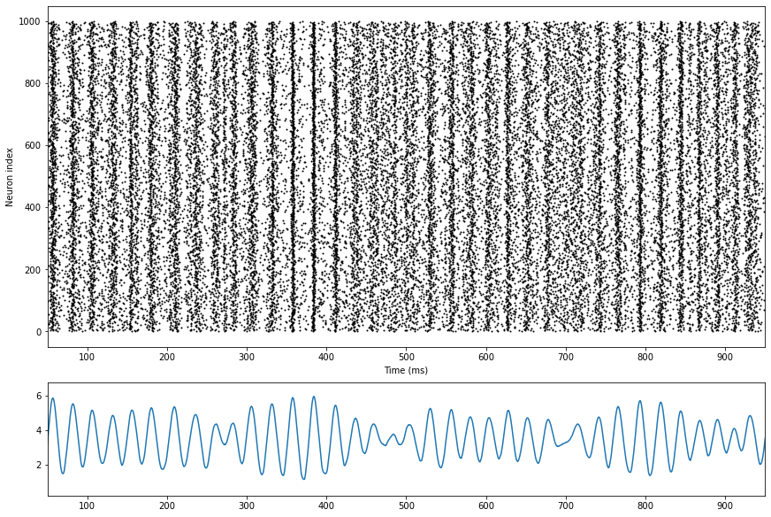

# BrainPy-Models

[](https://github.com/PKU-NIP-Lab/BrainPy-Models)    [](https://brainpy-models.readthedocs.io/en/latest/)     [](https://anaconda.org/brainpy/bpmodels) 

**Note**: *We welcome your contributions for model implementations.*


`BrainPy-Models` is a repository accompany with [BrainPy](https://github.com/PKU-NIP-Lab/BrainPy), which is a framework for spiking neural network simulation. With BrainPy, we implements the most canonical and effective neuron models and synapse models, and show them in `BrainPy-Models`.

Here, users can directly import our models into your network, and also can learn examples of how to use BrainPy from [Documentations](https://brainpy-models.readthedocs.io/en/latest/).

We provide the following models:


| Neuron models                                                | Synapse models                                               | Learning rules                                               | Networks                                                     |
| ------------------------------------------------------------ | ------------------------------------------------------------ | ------------------------------------------------------------ | ------------------------------------------------------------ |
| [Leaky integrate-and-fire model](https://brainpy-models.readthedocs.io/en/latest/apis/_autosummary/bpmodels.neurons.get_LIF.html) | [Alpha Synapse](https://brainpy-models.readthedocs.io/en/latest/apis/_autosummary/bpmodels.synapses.get_alpha.html) | [STDP](https://brainpy-models.readthedocs.io/en/latest/apis/_autosummary/bpmodels.learning_rules.get_STDP1.html) | [Continuous attractor network](https://brainpy-models.readthedocs.io/en/latest/examples/networks/CANN.html) |
| [Hodgkin-Huxley model](https://brainpy-models.readthedocs.io/en/latest/apis/_autosummary/bpmodels.neurons.get_HH.html) | [AMPA](https://brainpy-models.readthedocs.io/en/latest/apis/_autosummary/bpmodels.synapses.get_AMPA1.html) / [NMDA](https://brainpy-models.readthedocs.io/en/latest/apis/_autosummary/bpmodels.synapses.get_NMDA.html) | [BCM rule](https://brainpy-models.readthedocs.io/en/latest/apis/_autosummary/bpmodels.learning_rules.get_BCM.html) | [E/I balance network](https://brainpy-models.readthedocs.io/en/latest/examples/networks/EI_balanced_network.html) |
| [Izhikevich model](https://brainpy-models.readthedocs.io/en/latest/apis/_autosummary/bpmodels.neurons.get_Izhikevich.html) | [GABA_A](https://brainpy-models.readthedocs.io/en/latest/apis/_autosummary/bpmodels.synapses.get_GABAa1.html) / [GABA_B](https://brainpy-models.readthedocs.io/en/latest/apis/_autosummary/bpmodels.synapses.get_GABAb1.html) | [Oja\'s rule](https://brainpy-models.readthedocs.io/en/latest/apis/_autosummary/bpmodels.learning_rules.get_Oja.html) | [gamma oscillations](https://brainpy-models.readthedocs.io/en/latest/examples/networks/Gamma_oscillations.html) |
| [Morris--Lecar model](https://brainpy-models.readthedocs.io/en/latest/apis/_autosummary/bpmodels.neurons.get_MorrisLecar.html) | [Exponential Decay Synapse](https://brainpy-models.readthedocs.io/en/latest/apis/_autosummary/bpmodels.synapses.get_exponential.html) |                                                              |                                                              |
| [Generalized integrate-and-fire](https://brainpy-models.readthedocs.io/en/latest/apis/_autosummary/bpmodels.neurons.get_GeneralizedIF.html) | [Difference of Two Exponentials](https://brainpy-models.readthedocs.io/en/latest/apis/_autosummary/bpmodels.synapses.get_two_exponentials.html) |                                                              |                                                              |
| [Exponential integrate-and-fire](https://brainpy-models.readthedocs.io/en/latest/apis/_autosummary/bpmodels.neurons.get_ExpIF.html) | [Short-term plasticity](https://brainpy-models.readthedocs.io/en/latest/apis/_autosummary/bpmodels.synapses.get_STP.html) |                                                              |                                                              |
| [Quadratic integrate-and-fire](https://brainpy-models.readthedocs.io/en/latest/apis/_autosummary/bpmodels.neurons.get_QuaIF.html) | [Gap junction](https://brainpy-models.readthedocs.io/en/latest/apis/_autosummary/bpmodels.synapses.get_gap_junction.html) |                                                              |                                                              |
| [adaptive Exponential IF](https://brainpy-models.readthedocs.io/en/latest/apis/_autosummary/bpmodels.neurons.get_AdExIF.html) | [Voltage jump](https://brainpy-models.readthedocs.io/en/latest/apis/_autosummary/bpmodels.synapses.get_voltage_jump.html) |                                                              |                                                              |
| [adaptive Quadratic IF](https://brainpy-models.readthedocs.io/en/latest/apis/_autosummary/bpmodels.neurons.get_AdQuaIF.html) |                                                              |                                                              |                                                              |
| [Hindmarsh--Rose model](https://brainpy-models.readthedocs.io/en/latest/apis/_autosummary/bpmodels.neurons.get_HindmarshRose.html) |                                                              |                                                              |                                                              |
| [Wilson-Cowan model](https://brainpy-models.readthedocs.io/en/latest/apis/_autosummary/bpmodels.neurons.get_WilsonCowan.html) |                                                              |                                                              |                                                              |
## Installation

Install from source code:

    python setup.py install

Install ``BrainPy-Models`` using ``conda``:

    conda install -c brainpy bpmodels

Install `BrainPy-Models` using `pip`:

    pip install bpmodels

The following packages need to be installed to use `BrainPy-Models`:

-   Python >= 3.7
-   Matplotlib >= 2.0
-   BrainPy >= 0.3.0

## Quick Start

The use of `bpmodels` is very convenient, let\'s take an example of the implementation of the E-I balanced network.

We start by importing the `brainpy` and `bpmodels` packages and set profile.

```python
import brainpy as bp
import bpmodels
import numpy as np
import matplotlib.pyplot as plt

# set profile
bp.profile.set(jit=True, device='cpu',
               numerical_method='exponential')
```

The E-I balanced network is based on leaky Integrate-and-Fire (LIF) neurons connecting with single exponential decay synapses. As showed in the table above, `bpmodels` provides pre-defined LIF neuron model and exponential synapse model, so we can use [`bpmodels.neurons.get_LIF`](https://brainpy-models.readthedocs.io/en/latest/apis/_autosummary/bpmodels.neurons.get_LIF.html#bpmodels.neurons.get_LIF) and [`bpmodels.synapses.get_exponential`](https://brainpy-models.readthedocs.io/en/latest/apis/_autosummary/bpmodels.synapses.get_exponential.html) to get the pre-defined models.

```python
V_rest = -52.
V_reset = -60.
V_th = -50.

neu = bpmodels.neurons.get_LIF(V_rest=V_rest, V_reset = V_reset, V_th=V_th, noise=0., mode='scalar')

syn = bpmodels.synapses.get_exponential(tau_decay = 2., mode='scalar')
```


```python
# build network
num_exc = 500
num_inh = 500
prob = 0.1

JE = 1 / np.sqrt(prob * num_exc)
JI = 1 / np.sqrt(prob * num_inh)

group = bp.NeuGroup(neu, geometry=num_exc + num_inh, monitors=['spike'])

group.ST['V'] = np.random.random(num_exc + num_inh) * (V_th - V_rest) + V_rest

exc_conn = bp.SynConn(syn,
                      pre_group=group[:num_exc],
                      post_group=group,
                      conn=bp.connect.FixedProb(prob=prob))
exc_conn.ST['w'] = JE

inh_conn = bp.SynConn(syn,
                      pre_group=group[num_exc:],
                      post_group=group,
                      conn=bp.connect.FixedProb(prob=prob))
exc_conn.ST['w'] = -JI

net = bp.Network(group, exc_conn, inh_conn)
net.run(duration=500., inputs=(group, 'ST.input', 3.))

# visualization
fig, gs = bp.visualize.get_figure(4, 1, 2, 10)

fig.add_subplot(gs[:3, 0])
bp.visualize.raster_plot(net.ts, group.mon.spike, xlim=(50, 450))

fig.add_subplot(gs[3, 0])
rates = bp.measure.firing_rate(group.mon.spike, 5.)
plt.plot(net.ts, rates)
plt.xlim(50, 450)
plt.show()
```

Then you would expect to see the following output:



